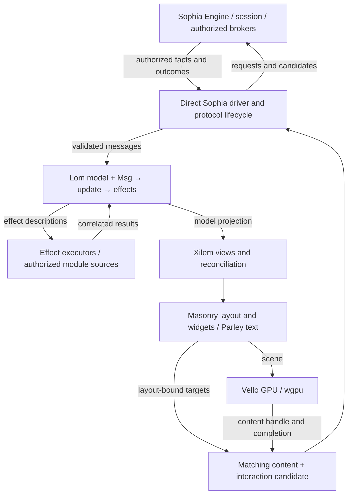

# Lom Architecture

**Role:** intended client architecture and implementation constraints.
**Status:** client design with a tested local Minimal UI, persistent content
lifecycle, implemented direct-GPU grant consumer, and exact presented workspace
actions; popouts and native GPU/input acceptance remain incomplete. See
[implementation evidence](docs/minimal-port.md).

Implementation must follow the [style guide](docs/style-guide.md), including
source-layout checks, test placement, logging, and warning discipline.

Lom is an original native shell for Sophia. Ironbar inspires the product:
configurable panels, useful modules, flexible styling, and rich popouts. Lom
aims to preserve familiar ironbar appearance, features and configuration
concepts through an incremental port. Its configuration and themes use KDL; it
does not interpret GTK CSS or promise drop-in compatibility or source parity.

The chosen stack is Rust, Xilem's reactive layer through `xilem_masonry`,
Masonry widgets, Parley/Fontique text support, and Vello GPU rendering through
`wgpu`. A direct Sophia driver replaces the conventional window-system runner.
GTK, a private Wayland bridge, and an X11 application window are not part of
this native-shell path.

This document governs Lom's implementation choices. Sophia's admission,
graphics, content, and input contracts govern what the client may do. A Lom
configuration or library API cannot expand that authority. In particular,
Sophia's implemented CPU-byte content lifecycle does not itself grant a GPU.
The accepted [presentation/execution decision](docs/notes/decisions/1qikt1av-use-explicit-gpu-permission-with-renderer-neutral-sophia-presentation.md)
selects explicit direct GPU permission on stock Linux, with no custom kernel,
mandatory GPU bridge or Vello dependency in Sophia. The production grant remains
closed until the [paired critical path](docs/notes/plans/pf4er77j-lom-daily-driver-critical-path.md)
meets its launch and resource-accounting gates.

## 1. Ownership boundaries

| Owner | Responsibilities |
| --- | --- |
| Lom application model | Module values, desired panel composition, selection, popout intent, configuration, and reduced lifecycle observations |
| Xilem and Masonry adapter | View reconciliation, widget tree, layout, private widget state, and candidate-specific interaction bindings |
| Lom runtime | Ordered intake, effects, timers, authorized service adapters, shell transport, and cancellation |
| Lom renderer | Vello scenes, GPU resources, rendering work, and local completion observations |
| Sophia session and brokers | Admission, supervision, capability grants, permitted facts, and issuer-scoped service actions |
| Sophia Engine | Authoritative placement, clipping, stacking, composition, presentation, physical target selection, capture, and revocation |
| Sophia WM | Application layout policy, including layout in the resulting work area |

Lom is one admitted shell client. Descriptor features, content, and indicator
feeds share that client's negotiated connection where supported. Modules are
not additional shell clients. Narthex remains an independent reference client;
it is a rollback option in a separate session, not a second shell beside Lom.
Lom must preserve required launcher/switcher behavior through its own admitted
descriptor capabilities before daily-driver promotion.



Arrows carry records, snapshots, commands, or typed handles. They do not grant
access to another owner's mutable state. The driver owns one coherent protocol
ledger; model observations are projections of it, not a second lifecycle owner.

## 2. Data-oriented application state

Use plain records and indexed tables for panels, modules, popouts, actions,
requests, and observed presentations. Separate desired state from acknowledged
state: requesting a popout does not mean an allocation exists or its pixels are
visible. Changed module data need not copy every panel's state.

Local identities are typed and generational where asynchronous or retained
references can outlive an entry. A module instance cannot inherit results from
its predecessor. Wire output, allocation, resource, action, and epoch identities
remain distinct from local widget IDs. Equal integers, labels, or geometry do
not establish identity or permission.

One owner mutates the application model. It contains no widgets, sockets,
Vello scenes, GPU objects, or callback closures. External effects return data;
they do not receive an `Arc<Mutex<Model>>` to mutate from worker tasks.

Xilem's view objects and Masonry's widget tree remain private presentation
structures. Data-oriented design does not require rewriting those libraries
as flat tables, removing all internal state, or introducing an ECS. Dense
storage and cached projections should follow actual traversal and update needs.

## 3. TEA application flow

The application follows the Elm Architecture:

```text
Model + Msg        → update → Model + Effects
Model              → view   → Xilem view tree
Effect + executor  → later Msg
```

These are ownership and determinism rules, not literal public Rust signatures
or a requirement to clone the model. The single owner may update its tables in
place. Given the same model and ordered message sequence, updates produce the
same semantic state and effects.

Messages include authorized facts and activations, module results, timer
observations, configuration results, and rendering/protocol outcomes. A reducer
does not read the clock, poll sockets, load fonts, render, or call host services.
View construction derives UI from state and performs no external side effects.

Components emit typed application messages through Xilem's action facilities.
The root routes them into the same reducer discipline used for external events.
Application actions do not mutate semantic state in arbitrary callbacks or
start I/O from a widget handler. Xilem and Masonry may still manage their own
internal update passes and presentation bookkeeping.

Effects are descriptions such as requesting an allocation, scheduling a timer,
requesting an authorized module operation, or cancelling a subscription. Each
asynchronous operation has a correlation identity and the relevant module,
request, or connection generation. Results for replaced or cancelled owners
cannot update their successors. Cancellation does not prove that an external
operation never executed; ambiguous actions are not blindly retried.

The runtime serializes observations before reduction and records enough
ordering information for deterministic fixtures. Preserve protocol ordering
within each connection. Apply known security revocations before dispatching
dependent queued effects; revalidate authority at execution rather than relying
only on the state when an effect was created.

Intake, pending effects, and frame work are bounded. Latest-value observations
may coalesce only when intermediate values have no contractual meaning. Actions,
terminal outcomes, cancellations, and release obligations are not replaceable
telemetry. Reserve capacity or apply explicit backpressure before accepting
work; exhaustion must have a visible bounded failure path.

TEA coordinates application behavior. It does not turn every GPU command or
Masonry layout operation into an application message, impose a global TEA loop
on Sophia Engine, or make an unbounded worker task safe. Workers cannot mutate
the UI owner, and in-process modules do not acquire crash isolation by using
messages.

## 4. Xilem and Masonry integration

Use `xilem_masonry` with `xilem_core` and Masonry. The top-level `xilem` wrapper
adds `masonry_winit`; Lom supplies a direct Sophia driver instead. Xilem owns
view construction and reconciliation. There is no separate Lom `ViewSpec`
language or replacement reconciliation framework.

The model owns semantic state: current values, selections, enabled modules, and
requested popouts. Masonry owns widget mechanics and layout caches. Temporary
widget editing state is permitted, but durable application changes cross back
as messages; it must not silently become a second authoritative module model.

The adapter projects the current model into Xilem views and uses acknowledged
allocation and scale facts to run Masonry layout. That resolved layout produces
both visual content and interaction records. A candidate binds them to the same
revision, allocation generation, and resource identities. Reusing static artwork
does not authorize mixing new pixels with old target meaning.

Masonry's alternative-driver boundary makes this integration plausible; it does
not establish compatibility with Sophia's input contract. Ordinary widget event
APIs and test harness mouse events are not automatically valid production input
routes. Exact action registration, delivery, and lifecycle behavior must be
proved with the chosen library revision.

## 5. Presented actions and popouts

Engine selects targets from the applicable presented snapshot, after clipping,
occlusion, and security precedence. Lom does not choose a target by hit-testing
newer local geometry or request a general input stream to satisfy a toolkit.

Retain an immutable binding from each candidate's target/action identity to its
semantic message and generational owner. Do not resolve a late activation by
invoking whichever callback currently occupies the same Xilem view path or
Masonry widget position. Retain the exact meaning, validate current authority
and owner lifetime, and reject stale owners without redirecting the action.
Resource-release and action-binding lifetimes are separate obligations.

Normal UI replacement does not invalidate an older binding merely because a
new local view exists: the old candidate may still be presented. Security
revocation invalidates dependent action rights immediately. Neither event
permits premature GPU storage reuse. Unknown, duplicate, or revoked activations
follow the negotiated rejection/acknowledgement rules rather than being replayed
into a replacement tree or connection.

The panel subset of the following sequence is implemented and exercised against
a real-socket protocol fixture. Each button target comes from the same Masonry
layout as its pixels and retains the exact TEA message until Sophia returns the
presented target action. Lom acknowledges that action, reduces the retained
message, and emits the already-authorized indicator activation once. Popout
actions and native acceptance remain open. Rendering is scheduled under negotiated pacing; local GPU completion is
not presentation.

```mermaid
sequenceDiagram
    participant E as Sophia Engine
    participant D as Sophia driver
    participant U as Lom TEA owner
    participant X as Xilem / Masonry
    participant G as Vello GPU

    E->>D: Activate exact presented panel target
    D->>U: Validated message with retained action meaning
    U->>U: Update popout intent
    U->>D: Request anchored allocation
    D->>E: Allocation request under current grant
    E-->>D: Allocation result and exact extent
    D-->>U: Acknowledged allocation fact
    U->>X: Derive views for that allocation
    X->>G: Render resolved scene when scheduled
    X->>D: Matching interaction snapshot
    G-->>D: Content readiness for the same candidate
    D->>E: Submit complete candidate under pacing permit
    E-->>D: Prepared
    E-->>D: Presented after native retirement
    D-->>U: Presentation observation
    E->>D: Outside-dismiss request; outside event consumed
    D->>U: Dismiss message without outside coordinates
    U->>D: Withdraw popout through candidate lifecycle
    D->>E: Complete replacement excluding popout
    E-->>D: Replacement presented; resources released when safe
    D-->>U: Correlated lifecycle observations
```

The popout is anchored to authorized parent presentation/allocation facts. A
rejected request cannot publish interactive content. Parent loss, output loss,
or revocation invalidates dependent work. Engine consumes outside dismissal
input, preventing click-through without disclosing the outside target or
location to Lom.

## 6. GPU rendering and resource lifetimes

Use Vello GPU through `wgpu`, with Parley/Fontique for text. Fonts and assets
must be explicitly available within the admitted environment. Toolkit defaults
do not grant host filesystem, service, GPU-device, or display access.

The renderer owns its explicitly admitted device, queues, scenes, textures,
caches, and local completion tracking. Device selection verifies the actual
adapter against Session's granted kernel identity; it never derives permission
from inherited display variables or an arbitrary first enumerated adapter. The driver owns protocol resource and candidate records.
They exchange handles and observations instead of sharing mutable ownership.
Shell invalidation requests work; it does not establish an independent,
unbounded presentation clock. Use negotiated pacing and a bounded renderer
schedule. The runtime has one capacity-one GPU worker separate from
protocol/control progress; it exchanges owned requests and completions with the
TEA runtime. Dirty work is coalesced per output and unchanged resources are
reused. GPU completion is polled without blocking protocol intake. An expired
job remains quarantined and fails the service rather than allowing its resources
to be silently reused.

| Fact | What it proves |
| --- | --- |
| Allocation acknowledged | The client may propose content within those exact authorized bounds |
| Local rendering complete | The renderer's specified work completed; no desktop visibility is implied |
| Resource accepted | Content was accepted under its resource contract; targets are not activated |
| Candidate prepared | Engine accepted the candidate for rendering; it is not yet presented |
| Candidate presented | That exact candidate retired on its applicable output |
| Candidate rejected or superseded | No new presentation authority follows; separate references may still exist |
| Resource released | The protocol's consumers no longer reference it; local owners must also finish before reuse |

Sophia's initial content ADR specifies immutable CPU pixel bytes. The accepted
execution design grants direct GPU access independently of that contract,
default denied. It exposes only the selected render node under its real kernel
basename and a bounded read-only sysfs discovery projection for that node, not
host `/sys`, an application display or a host-service endpoint. Lom authorizes
the Vulkan adapter by its exact DRM render `dev_t`. Direct access
accepts driver and GPU-resource availability risk; it does not promise a hard
aggregate VRAM quota or immunity from desktop-wide device loss. No custom
kernel or particular GPU accounting controller is a prerequisite.

Any later image transport must specify formats, synchronization, import
validation, immutable acceptance, peak copy overlap, recipient ownership and
release across disconnect or device loss. An acquire fence alone does not
prevent later producer writes; a DMA-BUF alone does not establish zero-copy.

Do not assign new wire kinds, capabilities, or file-descriptor semantics here.
The operator retained GPU rendering followed by bounded readback and CPU-byte
transfer for the first native path. Measure readback, copies, Engine upload and
actual native retirement before promoting direct GPU-buffer handoff. A future
GPU bridge is optional execution work, not a shell protocol requirement or
Vello server inside Sophia. CPU rendering is not a silent production fallback.

Deadlines initiate recovery; they never authorize reuse of storage still held
by GPU or Engine consumers. Budget reservations and terminal-response capacity
must precede accepting obligations. Bound known allocations and retain the
one-job/2000 ms readback recovery limits; do not present them as driver-memory
or hard GPU-time enforcement. A deadline cannot guarantee a kernel operation
returns. Sophia owns its finite content and compositor-backing charges through
retirement. Measure latency distributions, retained bytes and idle wakeups on a
defined workload before claiming daily-driver performance.

## 7. Modules, styling, and permissions

A module contributes model records, message variants, reducer behavior, effects,
and Xilem views. Use compiled Rust modules initially. Dynamic plugins,
scripting, and third-party code isolation require later designs.

Modules use authorized facts and service actions through runtime adapters.
Content permission grants no arbitrary execution, application focus, clipboard,
screen capture, or ambient desktop-service access. Configuration requests
behavior within existing permissions; it does not issue grants. Unsupported
capabilities produce explicit unavailable states, not substitute application
connections or broader access.

Ironbar informs layout flexibility, useful module combinations, theming, and
popout behavior. Its host integrations are not inherited permissions. Lom owns
its KDL v2 configuration and typed KDL theme data. The implemented subset and
migration mappings are documented in [configuration](docs/configuration.md);
unknown options are rejected instead of implying compatibility. Validated style
or configuration changes become model updates and use the same presentation lifecycle.

Labels and buttons form the first workflow. Text entry, general keyboard input,
continuous controls, exceptional local coordinates, and accessibility delivery
need supported and admitted Sophia contracts. Masonry's corresponding features
are useful implementation components, not proof that these external paths exist.

## 8. Reusable developer boundary

Keep three concerns separable: Lom's module/application code, the Xilem/Masonry
Sophia adapter, and toolkit-independent shell protocol lifecycle support. Future
clients should be able to reuse transport, framing, resource accounting, pacing,
and epoch handling without adopting Lom's widget choices.

Conceptual interfaces exchange model messages, effect requests/results,
authorized allocation facts, opaque content handles, and candidate outcomes.
Toolkit trees, closures, Vello scenes, and public shader programs do not enter
`sophia_shell_v1`. Wire compatibility remains independently testable.

This is a logical dependency map, not a requirement to create a crate for every
box immediately. Exact dependency versions, Rust toolchain, and public adapter
APIs are selected and recorded during the feasibility gate. Do not add unused
framework layers in advance of that evidence.

## 9. Validation and implementation gates

No row below is satisfied by this architecture document alone.

| Gate | Required evidence |
| --- | --- |
| Library integration | Pin source revisions/toolchain; exercise `xilem_masonry` with a direct driver and establish the actual renderer boundary without the Winit runner |
| TEA determinism | Replay identical model/message fixtures; compare state and effects; reject cancelled, replaced, and previous-epoch asynchronous results |
| Presented actions | Change local view, widget order, geometry, and action meaning while an older candidate is presented; route only the exact authorized action, with duplicate/stale-owner rejection |
| Panel and popout | Exercise a label, button, anchored popout, rejection, dismissal, and parent loss; test that outside dismissal does not click through |
| Topology and authority | Scale change, output removal, disconnect, and immediate revocation invalidate dependent work without granting unpresented input or replaying actions |
| Resource and queue bounds | Saturation, delayed rendering, stalled consumers, and device loss produce bounded outcomes without losing accepted obligations or reusing referenced storage |
| Offscreen GPU | Render the first workflow without an X11 or Wayland application connection in an explicitly authorized GPU test environment; retain source, binary, device, timing, memory, and image evidence |
| Sophia GPU execution and handoff | Implement the accepted explicit grant on stock Linux, check its lifecycle and refusal paths, verify the admitted adapter, and retain the existing CPU-byte presentation contract; no hard VRAM quota claim |
| Native acceptance | Use the available Sophia content implementation to demonstrate real presentation and input, distinct from local GPU completion or simulated widget events |

Use reducer fixtures, Masonry's test facilities, and renderer image checks at
their respective boundaries. Simulated mouse events can test widget behavior;
they cannot establish Sophia routing, disclosure, or presented-action safety.
Keep an independent protocol client/conformance path so sharing the Lom driver
does not make every test share its assumptions.

Test traces identify source and binary versions and distinguish local, protocol,
and native outcomes. Avoid sensitive module payloads in routine diagnostics.
Native runs require explicit authorization and do not follow automatically from
an offline passing test.

## References

Sophia authority and lifecycle contracts:

- [Data-oriented design](https://github.com/sophia-org/sophia-stack/blob/master/docs/dod.md)
- [Content shells](https://github.com/sophia-org/sophia-stack/blob/master/docs/content-shell.md)
- [Target-resolved input](https://github.com/sophia-org/sophia-stack/blob/master/docs/target-resolved-input.md)
- [Compositor graphics](https://github.com/sophia-org/sophia-stack/blob/master/docs/compositor-graphics.md)
- [Accepted presentation/execution decision](https://github.com/sophia-org/sophia-stack/blob/master/docs/notes/decisions/mn4mzcnf-separate-shell-presentation-from-gpu-execution-permission.md)
- [Initial CPU content ADR](https://github.com/sophia-org/sophia-stack/blob/master/docs/notes/decisions/6ndjwffd-content-capability-design-for-sophia_shell_v1.md)

Library boundaries inspected for this design on 2026-09-12 (these links track
upstream branches; they are not dependency pins):

- [Xilem crate architecture](https://github.com/linebender/xilem/blob/main/ARCHITECTURE.md)
- [Non-Winit embedding through xilem_masonry](https://github.com/linebender/xilem/blob/main/xilem_masonry/src/lib.rs)
- [Xilem Elm-style messages example](https://github.com/linebender/xilem/blob/main/xilem/examples/elm.rs)
- [Masonry](https://github.com/linebender/xilem/tree/main/masonry)
- [Parley text stack](https://github.com/linebender/parley)
- [Vello GPU](https://github.com/linebender/vello)
- [Ironbar product inspiration](https://github.com/JakeStanger/ironbar)
