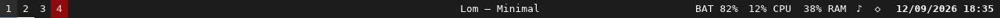
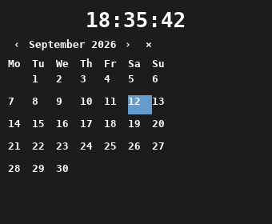

# lom

An original native desktop shell for [Sophia](https://github.com/sophia-org/sophia-stack).
**Лом** (*lom*) is Russian for a crowbar or heavy iron bar.

Lom brings ironbar-inspired panels, modules and popouts to a Rust UI built from
Xilem, Masonry, Parley and Vello GPU. Its application model follows explicit
TEA messages, reducers and effects. Configuration **and themes use KDL**.

## Minimal, the first port

The first components preserve ironbar Minimal's compact panel, palette,
monospace text, workspace states and clock/calendar. The bundled configuration
retains its start/center/end arrangement. Compatibility is incremental;
Lom is an original project, not a drop-in GTK/CSS replacement.





These images come from the real Xilem/Masonry view path, rendered with a
**software test renderer** for repeatable snapshots. They show synthetic fixture
data, not an admitted shell or proof of the GPU path.

| Component | Current evidence |
| --- | --- |
| KDL panel/theme configuration | Validated with positioned diagnostics and explicit availability reporting |
| Labels and workspaces | Actual views plus revision-6 indicator intake, naming, filtering, ordering and state styling |
| Clock/calendar | Explicit time observations, navigation, week numbers, open/dismiss intent; no native allocation yet |
| Focused title, battery, system info, tray | Fixture-backed text presentations only; authorized integrations and full features pending |
| Xilem/Masonry host | Windowless construction, rebuild, paint and teardown tested |
| GPU preview | Vello/Vulkan command implemented and compiled; GPU execution not yet accepted |
| Native Sophia shell | Persistent allocation/upload/pacing/presentation/retirement client passes a real-socket fixture; production GPU admission and native acceptance remain open |

The current preview uses three equally sized regions with independent clipping.
Its center stays centered; narrow layouts may clip module content. Sizes in KDL
are desired logical placement. A PNG does not acknowledge an Engine allocation.

## Try the configuration

```sh
cargo run --locked -- check-config \
  --config examples/minimal/config.kdl \
  --theme examples/minimal/theme.kdl
```

This requires no display, GPU or Sophia connection. See
[configuration and migration](docs/configuration.md) for the supported KDL subset,
style precedence, fixture grammar and intentional compatibility limits.

For an **explicitly authorized offscreen GPU run**, the separate command is:

```sh
cargo run --locked -- preview \
  --config examples/minimal/config.kdl \
  --theme examples/minimal/theme.kdl \
  --fixture examples/minimal/fixture.kdl \
  --output /tmp/lom-minimal-preview --width 1280 --scale 1
```

The output directory must not exist. The command initializes a Vulkan GPU,
writes `panel.png`, `calendar.png` when a clock is configured, and `evidence.txt`.
It refuses a reported CPU adapter. GPU failures return a nonzero exit and retain
`failure.txt`; no CPU fallback is selected. Readback is diagnostic output,
not an admitted Sophia transport. No X11, Wayland or Sophia connection is opened.

The production service uses one protected, supervisor-mounted document containing
the panel followed by its theme:

```sh
lom --serve
```

`--serve` is a supervisor entry point, not a command to run from an ordinary
terminal. It requires `SOPHIA_SHELL_SOCKET`, `SOPHIA_SHELL_CONFIG` and
`SOPHIA_SHELL_BAR_THICKNESS`, negotiates revision 6, allocates one panel per
published output, renders with Vello, and waits for actual `Presented` outcomes
before retiring replaced resources. The current Sophia profile denies production
content behind the earlier GPU-admission placeholder. The accepted
[replacement decision](docs/notes/decisions/1qikt1av-use-explicit-gpu-permission-with-renderer-neutral-sophia-presentation.md)
uses explicit direct GPU permission on stock Linux, with no custom kernel or
hard aggregate VRAM guarantee. Its launch integration is not implemented yet;
this documentation does not enable the grant or an ambient display fallback. Running `lom`
without a command exits with status 2. Nothing here installs or changes the
current desktop.

`lom content-proof --socket PATH` is reserved for Sophia's protected conformance
host. It requests one panel allocation, uploads canonical pixels, raises a frame
demand and submits one complete candidate under the returned permit. The current
headless host returns renderer failure by design; neither side reports that
exchange as native presentation.

## Architecture and development

Read [ARCHITECTURE.md](ARCHITECTURE.md), [the style guide](docs/style-guide.md),
[the implementation evidence](docs/minimal-port.md), and the
[daily-driver queue](todo.md). Lom tracks work with repository-local todo.txt
and `zk`; the [tracking contract](docs/work-tracking.md) defines task identity,
ordering, completion, and evidence.

- Xilem owns reconciliation; the application model contains no widgets or GPU objects.
- The runtime serializes observations and owns effects. Widgets emit semantic messages.
- Sophia owns placement, admission, composition, target selection and revocation.
- Modules acquire no ambient host-service or execution rights from configuration.
- GPU permission is independent of immutable presentation and exact native input.
- No custom kernel or mandatory GPU bridge is on the critical path; Vello remains a Lom dependency.
- The [paired implementation plan](docs/notes/plans/pf4er77j-lom-daily-driver-critical-path.md) names Lom and Sophia owners, dependencies and acceptance exits.

Linux builds need a C toolchain, `pkg-config`, and Fontconfig development files
(`libfontconfig1-dev` on Debian/Ubuntu; `fontconfig-devel` on Void), required by
upstream Fontique. This build dependency does not enable system-font discovery
in the preview host.

```sh
sh tools/check.sh
```

The same display-free, GPU-free gate runs in CI: source-length checks, formatting,
configuration/reducer/widget/image/CLI tests, doc tests, dependency-boundary audit
and strict Clippy. Sources are reviewed at 800 lines and rejected above 1,000.
Xilem packages are pinned together; the Rust toolchain and dependency lockfile
are committed. The gate fetches locked dependencies before offline graph inspection;
use `CARGO_NET_OFFLINE=true` with an already populated cache for a disconnected run.
Do not treat software snapshots as GPU or native acceptance.

## License

Lom code is BSD-3-Clause. Adapted ironbar material and bundled fonts retain their
licenses; see [THIRD_PARTY.md](THIRD_PARTY.md) and [LICENSE](LICENSE).
